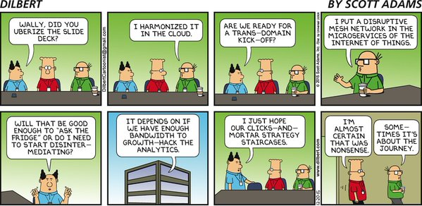
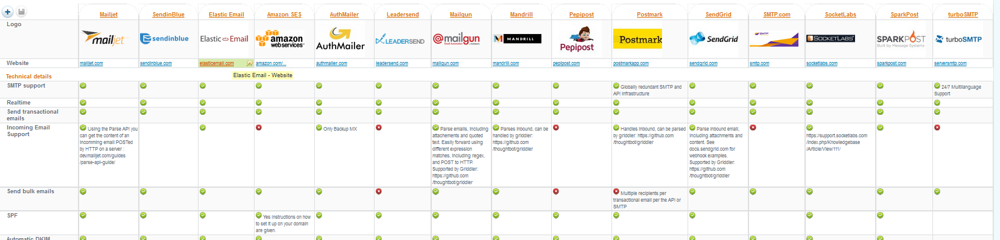

**Table of Contents**
<!-- MarkdownTOC -->

- [WebApp](#webapp)
	- [HTTP/2](#http2)
	- [WebSockets](#websockets)
	- [HTTP Status Codes](#http-status-codes)
	- [Enterprise Search Platforms](#enterprise-search-platforms)
		- [Elasticsearch](#elasticsearch)
	- [Caching](#caching)
		- [AMP Accelerated Mobile Pages](#amp-accelerated-mobile-pages)
		- [HAProxy](#haproxy)
		- [Varnish](#varnish)
		- [Memcached](#memcached)
		- [Redis](#redis)
	- [Apache and Tomcat](#apache-and-tomcat)
	- [Nginx](#nginx)
	- [GlassFish](#glassfish)
	- [Wordpress](#wordpress)
	- [WebLogic](#weblogic)
		- [Oracle Blogs: Middleware and Java](#oracle-blogs-middleware-and-java)
		- [WebLogic Resources](#weblogic-resources)
	- [JVM Latency: Caching, Off Heap, Data Grid](#jvm-latency-caching-off-heap-data-grid)
		- [Java Garbage Collection: Changes in Java 8. JMX monitoring](#java-garbage-collection-changes-in-java-8-jmx-monitoring)
	- [E-Mail](#e-mail)
	- [Video](#video)
	- [Distributed Messaging System. Message oriented middleware](#distributed-messaging-system-message-oriented-middleware)

<!-- /MarkdownTOC -->

# WebApp
## HTTP/2
- [SPDY & HTTP 2 with Akamai CTO Guy Podjarny](https://www.youtube.com/watch?v=WkLBrHW4NhQ)
	- [cURL mantainer: http2 explained 🌟](http://http2-explained.haxx.se/)
	- [cURL mantainer: curl and HTTP/2 by default](http://daniel.haxx.se/blog/2015/12/14/curl-and-http2-by-default/)
	- [cURL mantainer: A 2015 retrosprective](http://daniel.haxx.se/blog/2015/12/20/a-2015-retrospective/)
	- [http2.github.io HTTP/2 🌟](https://http2.github.io)
	- [http2.github.io HTTP/2 Frequently Asked Questions 🌟](https://http2.github.io/faq/)
	- [HTTP/2 resources](https://pinboard.in/u:rmurphey/t:http2/)
	- [A Simple Performance Comparison of HTTPS, SPDY and HTTP/2 🌟](https://blog.httpwatch.com/2015/01/16/a-simple-performance-comparison-of-https-spdy-and-http2/comment-page-1/)
	- [blog.cloudflare.com - Tools for debugging, testing and using HTTP/2](https://blog.cloudflare.com/tools-for-debugging-testing-and-using-http-2/)
	- [blog.cloudflare.com - HTTP/2 For Web Developers](https://blog.cloudflare.com/http-2-for-web-developers/)
- [HTTP/2 With JBoss EAP 7 - Tech Preview](http://blog.eisele.net/2015/11/http2-with-jboss-eap-7.html)
	- [Dzone - HTTP/2 With JBoss EAP 7: Tech Preview](https://dzone.com/articles/http2-with-jboss-eap-7-tech-preview)
- [simple-talk.com: Script Loading between HTTP/1.1 and HTTP/2](https://www.simple-talk.com/dotnet/asp.net/script-loading-between-http1.1-and-http2/)
- [5 Tips to Boost the Performance of Your Apache Web Server](http://www.tecmint.com/apache-performance-tuning/)

<iframe width="560" height="315" src="https://www.youtube-nocookie.com/embed/WkLBrHW4NhQ?rel=0" frameborder="0" allowfullscreen class="video"></iframe>

 

<iframe src="//www.slideshare.net/slideshow/embed_code/key/t9iH0GHtiPuf6q" width="595" height="485" frameborder="0" marginwidth="0" marginheight="0" scrolling="no" style="border:1px solid #CCC; border-width:1px; margin-bottom:5px; max-width: 100%;" allowfullscreen class="video"> </iframe> 
 <strong> <a href="//www.slideshare.net/lmacvittie/http2-changes-everything" title="HTTP/2 Changes Everything" target="_blank">HTTP/2 Changes Everything</a> </strong> from <strong><a href="//www.slideshare.net/lmacvittie" target="_blank">Lori MacVittie</a></strong> 

 

## WebSockets
- [WebSocket](https://en.wikipedia.org/wiki/WebSocket)
- [The State of Real-Time Web in 2016](https://banksco.de/p/state-of-realtime-web-2016.html)
- [SPDY and WebSocket Support at Akamai](https://blogs.akamai.com/2012/07/spdy-and-websocket-support-at-akamai.html)

<iframe src="//www.slideshare.net/slideshow/embed_code/key/dGwSJnsiEBOLQF" width="595" height="485" frameborder="0" marginwidth="0" marginheight="0" scrolling="no" style="border:1px solid #CCC; border-width:1px; margin-bottom:5px; max-width: 100%;" allowfullscreen class="video"> </iframe> 
 <strong> <a href="//www.slideshare.net/MarkRoden/websockets-pushing-the-web-forward" title="Websockets: Pushing the web forward" target="_blank">Websockets: Pushing the web forward</a> </strong> from <strong><a href="//www.slideshare.net/MarkRoden" target="_blank">Mark Roden</a></strong> 

 

<iframe src="//www.slideshare.net/slideshow/embed_code/key/J3GFdDQf8wm4fW" width="595" height="485" frameborder="0" marginwidth="0" marginheight="0" scrolling="no" style="border:1px solid #CCC; border-width:1px; margin-bottom:5px; max-width: 100%;" allowfullscreen class="video"> </iframe> 
 <strong> <a href="//www.slideshare.net/ramisayar/state-of-web-sockets" title="The State of WebSockets in Django" target="_blank">The State of WebSockets in Django</a> </strong> from <strong><a href="//www.slideshare.net/ramisayar" target="_blank">Rami Sayar</a></strong> 

 

## HTTP Status Codes
- [wikipedia: List of HTTP status codes](https://en.wikipedia.org/wiki/List_of_HTTP_status_codes)
- [slideshare: Http Status Code Errors in SEO](http://www.slideshare.net/AdelaRoger/http-status-code-errors-in-seo)

<iframe src="//www.slideshare.net/slideshow/embed_code/key/gYWUVIcqW40OUn" width="595" height="485" frameborder="0" marginwidth="0" marginheight="0" scrolling="no" style="border:1px solid #CCC; border-width:1px; margin-bottom:5px; max-width: 100%;" allowfullscreen class="video"> </iframe> 
 <strong> <a href="//www.slideshare.net/mainstreethost/http-status-codes-cheat-sheet" title="HTTP Status Codes Cheat Sheet: An Exhaustive List" target="_blank">HTTP Status Codes Cheat Sheet: An Exhaustive List</a> </strong> from <strong><a href="//www.slideshare.net/mainstreethost" target="_blank">Mainstreethost</a></strong> 

 

## Enterprise Search Platforms
- [Apache Solr vs ElasticSearch](http://solr-vs-elasticsearch.com/)
- [javacodegeeks.com: Apache Lucene Fundamentals Tutorial](http://www.javacodegeeks.com/2015/09/apache-lucene-fundamentals.html)

### Elasticsearch
- [Elasticsearch](elasticsearch.md)

## Caching
- [Wikipedia: Web cache](https://en.wikipedia.org/wiki/Web_cache)
- [Wikipedia: CDN Content delivery network](https://en.wikipedia.org/wiki/Content_delivery_network)
- [Wikipedia: Dynamic site acceleration](https://en.wikipedia.org/wiki/Dynamic_site_acceleration)
- [Slideshare: Caching](http://www.slideshare.net/NasceniaIT/brown-bag-caching-rafi-faisal-48694442)

### AMP Accelerated Mobile Pages
- A free, open source service that does all the work to make sites load fast
- [Google’s plan to speed up the mobile Web: Burn it down 🌟](http://thenextweb.com/insider/2015/10/07/googles-plan-to-speed-up-the-mobile-web-burn-it-down/)
- [ampproject.org](https://www.ampproject.org) Accelerated Mobile Pages Project
- [github.com/ampproject](https://github.com/ampproject)

### HAProxy
- [HAProxy](http://www.haproxy.org)
- [slideshare: Haproxy web performance](http://www.slideshare.net/haproxytech/haproxy-web-performance-55536394)
- [slideshare: Load Balancing MySQL with HAProxy](http://www.slideshare.net/Severalnines/load-balancing-mysql-with-haproxy-webinar-replay-english-44071270)
- [slideshare: Haproxy best practice](http://www.slideshare.net/haproxytech/haproxy-best-practice)
- [slideshare: How To Set Up SQL Load Balancing with HAProxy](http://www.slideshare.net/Severalnines/severalnines-ha-proxyjul20143)
- [slideshare: Performance Tuning of HAProxy for Database Load Balancing](http://www.slideshare.net/Severalnines/haproxy-mysql-slides)

<iframe src="//www.slideshare.net/slideshow/embed_code/key/hkcICcrntApXsr" width="595" height="485" frameborder="0" marginwidth="0" marginheight="0" scrolling="no" style="border:1px solid #CCC; border-width:1px; margin-bottom:5px; max-width: 100%;" allowfullscreen class="video"> </iframe> 
 <strong> <a href="//www.slideshare.net/haproxytech/haproxy-best-practice" title="Haproxy best practice" target="_blank">Haproxy best practice</a> </strong> from <strong><a target="_blank" href="//www.slideshare.net/haproxytech">haproxytech</a></strong> 

 

### Varnish
- [Varnish Cache](https://www.varnish-cache.org/)
- [fedoramagazine.org: Varnish: Your site faster and more stable](https://fedoramagazine.org/varnish-site-faster-stable/)
- [Red Hat Developer Blog. Tag: Varnish](https://developerblog.redhat.com/tag/varnish/)
- [Red Hat Enterprise Linux Blog. Tag: Varnish](http://rhelblog.redhat.com/tag/varnish/)
- [varnish-cache.org: Installation on RedHat](https://www.varnish-cache.org/installation/redhat)
- [Hitch - scalable TLS proxy. Hitch is a libev-based high performance SSL/TLS proxy by Varnish Software](https://hitch-tls.org/)
- [slideshare: Varnish - Tips & Tricks - 4Developers 2015](http://www.slideshare.net/piotrpasich/varnish-47199139)

<iframe src="//www.slideshare.net/slideshow/embed_code/key/fQrbxcE741QjvX" width="595" height="485" frameborder="0" marginwidth="0" marginheight="0" scrolling="no" style="border:1px solid #CCC; border-width:1px; margin-bottom:5px; max-width: 100%;" allowfullscreen class="video"> </iframe> 
 <strong> <a href="//www.slideshare.net/kimlindholm/varnish-configuration-step-by-step" title="Varnish Configuration Step by Step" target="_blank">Varnish Configuration Step by Step</a> </strong> from <strong><a target="_blank" href="//www.slideshare.net/kimlindholm">Kim Stefan Lindholm</a></strong> 

 

<iframe src="//www.slideshare.net/slideshow/embed_code/key/JlHlus2tBHDZVi" width="595" height="485" frameborder="0" marginwidth="0" marginheight="0" scrolling="no" style="border:1px solid #CCC; border-width:1px; margin-bottom:5px; max-width: 100%;" allowfullscreen class="video"> </iframe> 
 <strong> <a href="//www.slideshare.net/ivanchepurnyi/advanced-varnishusage" title="Varnish Cache and its usage in the real world!" target="_blank">Varnish Cache and its usage in the real world!</a> </strong> from <strong><a target="_blank" href="//www.slideshare.net/ivanchepurnyi">Ivan Chepurnyi</a></strong> 

 

<iframe src="//www.slideshare.net/slideshow/embed_code/key/crhLrhAgnlZmLv" width="595" height="485" frameborder="0" marginwidth="0" marginheight="0" scrolling="no" style="border:1px solid #CCC; border-width:1px; margin-bottom:5px; max-width: 100%;" allowfullscreen class="video"> </iframe> 
 <strong> <a href="//www.slideshare.net/samanthaquinonestembies/superchargin-varnish" title="Supercharging Content Delivery with Varnish" target="_blank">Supercharging Content Delivery with Varnish</a> </strong> from <strong><a target="_blank" href="//www.slideshare.net/samanthaquinonestembies">Samantha Quiñones</a></strong> 

 

### Memcached
- [memcached.org](http://memcached.org)
- [Slideshare: Introduction to memcached](http://www.slideshare.net/oemebamo/introduction-to-memcached)

<iframe src="//www.slideshare.net/slideshow/embed_code/key/rqpOlUNkU6NOvo" width="595" height="485" frameborder="0" marginwidth="0" marginheight="0" scrolling="no" style="border:1px solid #CCC; border-width:1px; margin-bottom:5px; max-width: 100%;" allowfullscreen class="video"> </iframe> 
 <strong> <a href="//www.slideshare.net/oemebamo/introduction-to-memcached" title="Introduction to memcached" target="_blank">Introduction to memcached</a> </strong> from <strong><a target="_blank" href="//www.slideshare.net/oemebamo">Jurriaan Persyn</a></strong> 

 

### Redis
- [redis.io](http://redis.io)
- [Slideshare: Introduction to Redis](http://www.slideshare.net/dvirsky/introduction-to-redis)

<iframe src="//www.slideshare.net/slideshow/embed_code/key/3nvYR34GEVLEei" width="595" height="485" frameborder="0" marginwidth="0" marginheight="0" scrolling="no" style="border:1px solid #CCC; border-width:1px; margin-bottom:5px; max-width: 100%;" allowfullscreen class="video"> </iframe> 
 <strong> <a href="//www.slideshare.net/dvirsky/introduction-to-redis" title="Introduction to Redis" target="_blank">Introduction to Redis</a> </strong> from <strong><a target="_blank" href="//www.slideshare.net/dvirsky">Dvir Volk</a></strong> 

 

<iframe src="//www.slideshare.net/slideshow/embed_code/key/42WDX39CPeO9e6" width="595" height="485" frameborder="0" marginwidth="0" marginheight="0" scrolling="no" style="border:1px solid #CCC; border-width:1px; margin-bottom:5px; max-width: 100%;" allowfullscreen class="video"> </iframe> 
 <strong> <a href="//www.slideshare.net/NasceniaIT/brown-bag-caching-rafi-faisal-48694442" title="Caching" target="_blank">Caching</a> </strong> from <strong><a target="_blank" href="//www.slideshare.net/NasceniaIT">Nascenia IT</a></strong> 

 

## Apache and Tomcat
- [5 Tips to Boost the Performance of Your Apache Web Server](http://www.tecmint.com/apache-performance-tuning/)
- [How to set up a cluster with Tomcat 8, Apache and mod_jk.Tomcat Performance Monitoring and Tuning](http://blog.c2b2.co.uk/2014/05/tomcat-performance-monitoring-and-tuning.html)
- [scriptrock.com: 15 Ways To Secure Apache Tomcat 8](https://www.scriptrock.com/articles/15-ways-to-secure-apache-tomcat-8)
- [middlewaresnippets.blogspot.com - Working with Apache HTTP Server](http://middlewaresnippets.blogspot.com/2015/05/working-with-apache-http-server.html)
	- [middlewaresnippets.blogspot.com - Working some more with Apache HTTP Server](http://middlewaresnippets.blogspot.com/2015/09/working-some-more-with-apache-http.html)

## Nginx
- [How to Setup Name-based and IP-based Virtual Hosts (Server Blocks) with NGINX](http://www.tecmint.com/nginx-name-based-and-ip-based-virtual-hosts-server-blocks/)
- [TCP Load Balancing in NGINX Plus r5 - NGINX](http://nginx.com/blog/tcp-load-balancing-in-nginx-plus-r5/)
- [Nginxconf 2014. When Dynamic Becomes Static:The Next Step in Web Caching Techniques: Wim Godden](https://www.youtube.com/watch?v=OssIuHbgzJY)
- [cyberciti.biz: Top 20 Nginx WebServer Best Security Practices 🌟](http://www.cyberciti.biz/tips/linux-unix-bsd-nginx-webserver-security.html)
- [scriptrock.com: 10 Tips For Securing Your Nginx Deployment](https://www.scriptrock.com/articles/10-tips-for-securing-your-nginx-deployment)
- [dzone: The Benefits of Microcaching with NGINX](https://dzone.com/articles/the-benefits-of-microcaching-with-nginx)
- [nginx.com: Scaling Web Applications with NGINX – Part I: Load Balancing 🌟](https://www.nginx.com/blog/scaling-web-applications-nginx-part-load-balancing/)
	- [dzone: Scaling Web Applications with NGINX – Part II: Caching and Monitoring](https://dzone.com/articles/scaling-web-applications-with-nginx-part-ii-cachin)
- [Nginx: a caching, thumbnailing, reverse proxying image server? 🌟](http://charlesleifer.com/blog/nginx-a-caching-thumbnailing-reverse-proxying-image-server-/)
- [highscalability.com: Building nginx and Tarantool based services 🌟](http://highscalability.com/blog/2016/2/17/building-nginx-and-tarantool-based-services.html)

<iframe src="//www.slideshare.net/slideshow/embed_code/key/Mu2STrGXh1IB86" width="595" height="485" frameborder="0" marginwidth="0" marginheight="0" scrolling="no" style="border:1px solid #CCC; border-width:1px; margin-bottom:5px; max-width: 100%;" allowfullscreen class="video"> </iframe> 
 <strong> <a href="//www.slideshare.net/tuxtoti/nginx-tips-and-tricks-13087831" title="Nginx - Tips and Tricks." target="_blank">Nginx - Tips and Tricks.</a> </strong> from <strong><a href="//www.slideshare.net/tuxtoti" target="_blank">Harish S</a></strong> 

 
 

<iframe src="//www.slideshare.net/slideshow/embed_code/key/wC5wngKnh2iydS" width="595" height="485" frameborder="0" marginwidth="0" marginheight="0" scrolling="no" style="border:1px solid #CCC; border-width:1px; margin-bottom:5px; max-width: 100%;" allowfullscreen class="video"> </iframe> 
 <strong> <a href="//www.slideshare.net/Nginx/nginx-highperformance-caching" title="NGINX High-performance Caching" target="_blank">NGINX High-performance Caching</a> </strong> from <strong><a href="//www.slideshare.net/Nginx" target="_blank">NGINX, Inc.</a></strong> 

 

<blockquote class="twitter-tweet tw-align-center" data-lang="es">
Nginx: a caching, thumbnailing, reverse proxying image server? <a href="https://twitter.com/hashtag/unix?src=hash">#unix</a> <a href="https://twitter.com/hashtag/linux?src=hash">#linux</a> <a href="https://twitter.com/hashtag/python?src=hash">#python</a> <a href="https://twitter.com/hashtag/sysadmin?src=hash">#sysadmin</a>  <a href="https://t.co/O9Es1SN3jV">https://t.co/O9Es1SN3jV</a>
&mdash; nixCraft (@nixcraft) <a href="https://twitter.com/nixcraft/status/700407777483591680">febrero 18, 2016</a></blockquote>

## GlassFish
- [twitter.com/glassfish](https://twitter.com/glassfish)

## Wordpress
- [stosu.com](https://stosu.com) Free How-To Tutorials for WordPress and Windows Users

## WebLogic
### Oracle Blogs: Middleware and Java
- [WebLogic Community](http://weblogiccommunity.com)
- [Oracle EMEA Partner Community for WebLogic (WLS)](http://www.oracle.com/partners/goto/wls-emea)
- [Oracle Middleware Blog](http://oraclemiddlewareblog.com/)
- [oraclejavamagazine-digital.com - Java Magazine](http://www.oraclejavamagazine-digital.com)
- [javacodegeeks.com](http://www.javacodegeeks.com/)
- [Oracle Community](https://community.oracle.com)
	- [Oracle Community - WebLogic](https://community.oracle.com/community/fusion_middleware/weblogic)
- [middlewaresnippets.blogspot.com](http://middlewaresnippets.blogspot.com)
- [Unversioned.blogspot.gr](http://unversioned.blogspot.gr/) Open Source, Linux, Java, WebLogic, DevOps, FMW, SOA
- [multikoop.blogspot.com - Practical experience on Oracle products. WebLogic, ADF, MAF, SOA, WebCenter, JDeveloper, Oracle Cloud](http://multikoop.blogspot.com)
	- [multikoop.blogspot.com - WebLogic](http://multikoop.blogspot.com/search/label/weblogic)
- [avanttic blog](http://blog.avanttic.com/)
	- [avanttic blog - weblogic](http://blog.avanttic.com/tag/weblogic/)

### WebLogic Resources
- [WebLogic 12c Enterprise Deployment Architecture in the Amazon Cloud](http://oraclemiddlewareblog.com/2015/10/13/weblogic12c-architecture-in-the-amazon-cloud/)
- [SlideShare - 12 Things You Should Know About WebLogic Server 12.2.1](http://www.slideshare.net/FrankMunz1/12-things-you-should-know-about-weblogic-server-1221-oow2015)
- [middlewaresnippets.blogspot.com - WebLogic Server on Linux 7](http://middlewaresnippets.blogspot.com/2015/04/weblogic-server-on-linux-7.html)
	- [middlewaresnippets.blogspot.com - WebLogic Domain Partitioning](http://middlewaresnippets.blogspot.com/2015/11/weblogic-domain-partitioning.html)
	- [middlewaresnippets.blogspot.com - Monitoring Domain Partitions](http://middlewaresnippets.blogspot.com/2015/11/monitoring-domain-partitions.html)
	- [middlewaresnippets.blogspot.com - Deploying Applications to Domain Partitions](http://middlewaresnippets.blogspot.com/2015/11/deploying-applications-to-domain.html)
	- [middlewaresnippets.blogspot.com - Security Recovery - LDAP server](http://middlewaresnippets.blogspot.com/2015/07/security-recovery.html)
- [blogs.oracle.com - WLST Scripting to Get WebLogic Libraries and Deployed Applications](https://blogs.oracle.com/practicalbpm/entry/wlst_scripting_to_get_weblogic)
- [Java Serialization Vulnerability Threatens Millions of Applications . Contrast security is promoting their solution for a vulnerability that affects WebLogic, WebSphere, JBoss, Jenkins, and OpenNMS.](https://dzone.com/articles/java-serialization-vulnerability-threatens-million)
- [Oracle WebLogic Server 12c Advanced Administration Cookbook](http://it-ebooks.info/book/3020/)
- [Oracle's docker images. A real WebLogic cluster on a swarm of Docker containers](https://github.com/oracle/docker-images/commit/ad34abf5f5b1186ea119ec4586fd158c0631182b)
- [weblogiccommunity.com: WLS 12.2.1 Oracle Universal Connection Pool (UCP) Datasource](http://weblogiccommunity.com/2015/12/26/wls-ucp-datasource-by-steve-felts/)
- [Deploying to the Oracle Java Cloud Service using FlexDeploy](http://flexagon.com/2015/07/deploying-to-the-oracle-java-cloud-service-using-flexdeploy/)
- [javacodegeeks.com: Weblogic Server Administration Tutorial](http://examples.javacodegeeks.com/core-java/weblogic-server-administration-tutorial/)
- [Automated Software Testing of Fusion Middleware applications with FlexDeploy](http://adfpractice-fedor.blogspot.com.br/2015/10/automated-software-testing-of-fusion.html)
- [WLSDM | Native WebLogic Smart Dashboard & Monitoring](http://www.wlsdm.com) WLSDM is a WebLogic console extension which enables monitoring for WebLogic MBean metrics. It is very easy to create alarms and notifications by using WLSDM metric browser. WLSDM can store any WebLogic metric values historically and also can generate graphical reports.
	- [Advanced WebLogic Monitoring: Develop JMX MBeans and Automate with WLSDM Metric Actions 🌟](http://www.wlsdm.com/tutorials/advanced-weblogic-monitoring-develop-jmx-mbeans-and-automate-with-wlsdm-metric-actions/)

<iframe src="//www.slideshare.net/slideshow/embed_code/key/tUDLzhM0sgSgcp" width="595" height="485" frameborder="0" marginwidth="0" marginheight="0" scrolling="no" style="border:1px solid #CCC; border-width:1px; margin-bottom:5px; max-width: 100%;" allowfullscreen class="video"> </iframe> 
 <strong> <a href="//www.slideshare.net/FrankMunz1/12-things-you-should-know-about-weblogic-server-1221-oow2015" title="12 Things You Should Know About WebLogic Server 12.2.1 #oow2015 " target="_blank">12 Things You Should Know About WebLogic Server 12.2.1 #oow2015 </a> </strong> from <strong><a href="//www.slideshare.net/FrankMunz1" target="_blank">Frank Munz</a></strong> 

 

<blockquote class="twitter-tweet tw-align-center" data-lang="es">
JDK 8 and WebLogic 12.2.1 by Frank Munz <a href="https://t.co/rByhPDsB7v">https://t.co/rByhPDsB7v</a>
&mdash; WebLogic Community (@wlscommunity) <a href="https://twitter.com/wlscommunity/status/696229275150602240">febrero 7, 2016</a></blockquote>

## JVM Latency: Caching, Off Heap, Data Grid
- [dzone.com - Refcard: Java Caching. JCache and other caching APIs, as well as multiple strategies for implementing temporary data storage in your application](http://bit.ly/1RbGgms)
- [Reminder: JDK 7 will be EOL soon. Oracle won't publish any Public Updates to JDK 7 after April 2015](http://www.oracle.com/technetwork/java/javase/downloads/eol-135779.html)
- [Free eGuide: JVM Troubleshooting Guide](http://freepromagazine.blogspot.de/2014/07/free-eguide-jvm-troubleshooting-guide.html)
- [vogella.com: Java Performance - Memory and Runtime Analysis - Tutorial](http://www.vogella.com/tutorials/JavaPerformance/article.html)
- [On heap vs off heap memory usage](http://www.javacodegeeks.com/2014/12/on-heap-vs-off-heap-memory-usage.html)
- [Dr. Low Latency or: How I Learned to Stop Worrying about Pauses and Love the Memory](http://www.c2b2.co.uk/javazone-2013-low-latency)
- [What is a Data Grid?](http://www.c2b2.co.uk/what_is_data_grid_webinar)

### Java Garbage Collection: Changes in Java 8. JMX monitoring
- [How Garbage Collection differs in the three big JVMs](http://apmblog.dynatrace.com/2011/05/11/how-garbage-collection-differs-in-the-three-big-jvms/)
- [One important change in Memory Management in Java 8](http://karunsubramanian.com/websphere/one-important-change-in-memory-management-in-java-8/)
	- [PermGen removed](http://www.infoq.com/articles/Java-PERMGEN-Removed)
	- [Mi análisis: cambios en la gestión de memoria de Java 8. Diferencias en distintas implementaciones de JVM](jvm-mem.md)
- [middlewaresnippets.blogspot.com - Monitoring with JMX](http://middlewaresnippets.blogspot.com/2014/10/monitoring-with-jmx.html)

<iframe src="//www.slideshare.net/slideshow/embed_code/key/n2WeaBLq1lzQcN" width="595" height="485" frameborder="0" marginwidth="0" marginheight="0" scrolling="no" style="border:1px solid #CCC; border-width:1px; margin-bottom:5px; max-width: 100%;" allowfullscreen class="video"> </iframe> 
 <strong> <a href="//www.slideshare.net/ihji/jvm-garbage-collection-tuning" title="JVM Garbage Collection Tuning" target="_blank">JVM Garbage Collection Tuning</a> </strong> from <strong><a href="//www.slideshare.net/ihji" target="_blank">ihji</a></strong> 

 

## E-Mail
- [tech-faq.com: How Does the Email System Work?](http://www.tech-faq.com/how-the-email-system-works.html)
- [Best Transactional Email Service Comparison](http://socialcompare.com/en/comparison/transactional-emailing-providers-mailjet-sendgrid-critsend)
- [Google Improves Gmail’s Spam Filters, Launches New Analytics Tool For Bulk Senders](http://techcrunch.com/2015/07/09/google-improves-gmails-spam-filters-launches-new-analytics-tool-for-bulk-senders/)
- [five.sentenc.es: email productivity](http://five.sentenc.es/)
- [Amazon’s Email And Calendaring Service, Amazon WorkMail, Exits Preview](http://techcrunch.com/2016/01/05/amazons-own-email-calendaring-service-amazon-workmail-exits-preview/)

<a href="http://securityreactions.tumblr.com/post/135651440303/nmap-has-discovered-an-open-smtp-relay">http://securityreactions.tumblr.com/post/135651440303/nmap-has-discovered-an-open-smtp-relay</a>

## Video
- [kaltura.org](http://www.kaltura.org)
- [BBC R&D: H.265/HEVC vs H.264/AVC: 50% bit rate savings verified](http://www.bbc.co.uk/rd/blog/2016/01/h-dot-265-slash-hevc-vs-h-dot-264-slash-avc-50-percent-bit-rate-savings-verified) A research team from the BBC has done a series of tests to confirm earlier computations showing a ~50% savings in bit rate for H.265/HEVC compared to video using H.264/AVC at comparable quality. 
- [emezeta.com: Cómo usar ffmpeg para editar video](http://www.emezeta.com/articulos/como-usar-ffmpeg-para-editar-video)

<blockquote class="twitter-tweet tw-align-center" data-lang="es">
Why HBO is so scared of Netflix <a href="https://t.co/AVwt6IfP72">https://t.co/AVwt6IfP72</a> <a href="https://t.co/ZmBfSkE1Dg">pic.twitter.com/ZmBfSkE1Dg</a>
&mdash; Business Insider (@businessinsider) <a href="https://twitter.com/businessinsider/status/699642563486203904">febrero 16, 2016</a></blockquote>

## Distributed Messaging System. Message oriented middleware 
- [RabbitMQ](https://www.rabbitmq.com/)
- [Apache Kafka](http://kafka.apache.org/)
- [Setting Up and Running Apache Kafka on Windows OS](https://dzone.com/articles/running-apache-kafka-on-windows-os)
- [Lose the Lock While Embracing Concurrency](https://dzone.com/articles/lose-the-lock-while-embracing-concurrency-brave-ne) Adopting concurrency? You may want to lose the lock. Here's a look at basics with message routing, such as concurrent timelines, linearizability​, and more!
- [DZone refcard: AMQP Essentials](https://dzone.com/refcardz/amqp-essentials) The Binary Transfer Protocol for Enterprise Applications and IoT
- [Simple job queue in Bash using a FIFO](http://blog.garage-coding.com/2016/02/05/bash-fifo-jobqueue.html)

<iframe src="//www.slideshare.net/slideshow/embed_code/key/egsQRPlbfRcgTt" width="595" height="485" frameborder="0" marginwidth="0" marginheight="0" scrolling="no" style="border:1px solid #CCC; border-width:1px; margin-bottom:5px; max-width: 100%;" allowfullscreen class="video"> </iframe> 
 <strong> <a href="//www.slideshare.net/PovilasBalzaravicius/reducing-load-with-rabbitmq" title="Reducing load with RabbitMQ" target="_blank">Reducing load with RabbitMQ</a> </strong> from <strong><a href="//www.slideshare.net/PovilasBalzaravicius" target="_blank">Povilas Balzaravičius</a></strong> 

 
 

<iframe src="//www.slideshare.net/slideshow/embed_code/key/4LiXl3TsDw9N9O" width="595" height="485" frameborder="0" marginwidth="0" marginheight="0" scrolling="no" style="border:1px solid #CCC; border-width:1px; margin-bottom:5px; max-width: 100%;" allowfullscreen class="video"> </iframe> 
 <strong> <a href="//www.slideshare.net/opensourcementor/webinar-maximize" title="Maximize information exchange in your enterprise with AMQP" target="_blank">Maximize information exchange in your enterprise with AMQP</a> </strong> from <strong><a href="//www.slideshare.net/opensourcementor" target="_blank">Kenneth Peeples</a></strong> 

 
 

